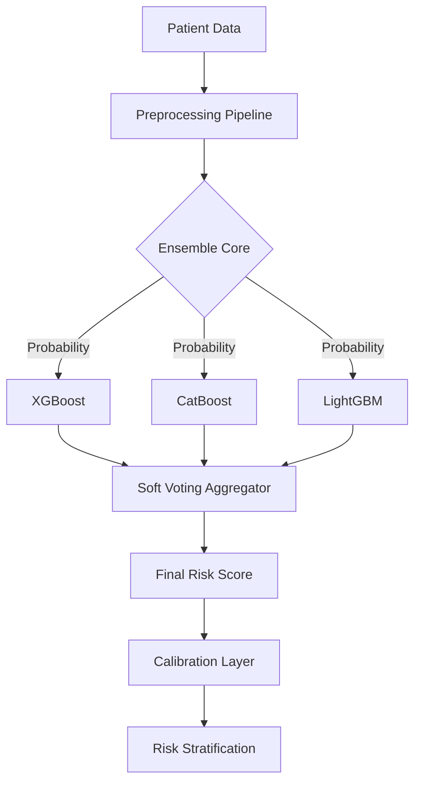

<div align="center">

# 🏥 𝐀𝐬𝐭𝐫𝐚𝐌𝐞𝐝: 𝐂𝐥𝐢𝐧𝐢𝐜𝐚𝐥 𝐑𝐢𝐬𝐤 𝐀𝐈
### *Next-Generation Predictive Analytics & Decision Support System*

[](https://huggingface.co/spaces/purvansh01/astramed-bd)
[](https://clinical-risk-predictor-nine.vercel.app/)
[](LICENSE)
[](https://github.com)

**AstraMed** represents a paradigm shift in preventive medicine, combining **State-of-the-Art (SOTA) Machine Learning** with a **"Neo-Medical" Glassmorphism UI** to deliver interpreting, accurate, and actionable health insights.

[**Explore Live App**](https://clinical-risk-predictor-nine.vercel.app/) | [**Test API Engine**](https://huggingface.co/spaces/purvansh01/astramed-bd/docs) | [**View Code**](https://github.com/purvanshjoshi/clinical-risk-predictor)

</div>

---

## 🌍 Live Ecosystem

| Service Component | Status | Technology | Deployment URL |
|:------------------|:-------|:-----------|:---------------|
| **Frontend Platform** | 🟢 **Online** | React + Vite + Tailwind | [**Launch Dashboard**](https://clinical-risk-predictor-nine.vercel.app/) |
| **Prediction Engine** | 🟢 **Online** | FastAPI + XGBoost/CatBoost | [**API Docs**](https://huggingface.co/spaces/purvansh01/astramed-bd/docs) |
| **ML Inference Node** | 🟢 **Online** | Python 3.10 | [**Model Spaces**](https://huggingface.co/spaces/purvansh01/astramed-bd) |

---

## 🧠 The Machine Learning Engine

AstraMed is powered by an enterprise-grade **Ensemble Learning Pipeline** designed for high-stakes clinical environments where accuracy and explainability are paramount.

### 🔬 Architecture: The "Tri-Force" Ensemble
Instead of relying on a single model, we leverage a **Soft-Voting Ensemble** of three industry-leading gradient boosting algorithms:

1.  **XGBoost (eXtreme Gradient Boosting)**: Optimized for speed and performance on structured clinical data.
2.  **CatBoost (Categorical Boosting)**: Handles categorical features (e.g., "Gender", "Smoking History") natively without leakage.
3.  **LightGBM**: Provides high efficiency on large-scale datasets.



### 🔍 Explainable AI (XAI) with SHAP
We solve the "Black Box" problem using **SHAP (SHapley Additive exPlanations)**. Every prediction comes with a mathematical justification:
-   **Local Interpretability**: Why did *this specific patient* get a high risk score? (e.g., "+15% due to High HbA1c").
-   **Global Interpretability**: What factors drive disease risk across the entire population?

### 🔄 "What-If" Counterfactual Simulation
AstraMed goes beyond static predictions. Our **Counterfactual Engine** allows clinicians to simulate outcomes:
> *"If the patient reduces BMI by 2 points and lowers HbA1c to 5.7%, how does their 5-year risk change?"*
This empowers shared decision-making and personalized goal setting.

---

## 💎 "Neo-Medical" User Experience

We have overhauled the traditional "drab" clinical software look with a **Pro Max UI/UX** standard:

### 🎨 Design System: Glassmorphism 2.0
-   **Aesthetic**: Frosted glass panels, subtle noise textures, and deep blurs create a hierarchy of information.
-   **Color Palette**: A curated mix of **Clinical Teal** (Confidence), **Slate** (Structure), and **Ethereal Blue** (Calm).
-   **Typography**: **Figtree** for modern readability & **Inter** for data density.

### 🧩 Key Interface Features
1.  **The Bento Grid Dashboard**: A dense, grid-based layout that surfaces Critical Vitals, Risk Profiles, and Longitudinal Trends in a single view.
2.  **Interactive Bio-Sliders**: Replaced manual data entry with fluid range sliders that provide real-time visual feedback (e.g., "Obese" tag appears dynamically as BMI slider moves).
3.  **Radial Risk Gauge**: A custom-animated Recharts visualization that provides immediate, color-coded risk context.
4.  **Audit Logs**: Role-Based Access Control (RBAC) ensures only Admins can view detailed clinician activity logs.

---

## 🛠️ Technical Stack

<div align="center">

### Frontend


### Backend & ML


### DevOps & Infrastructure


</div>

---

## ⚡ Accelerated Setup

### Option A: Docker (Recommended)
Launch the entire stack with a single command.
```bash
docker-compose up --build
```
*Access Frontend at `http://localhost:3000` & Backend at `http://localhost:8001`*

### Option B: Manual Installation

#### 1. Backend Engine
```bash
cd backend
python -m venv venv
source venv/bin/activate
pip install -r requirements.txt
python api.py
```

#### 2. Frontend Application
```bash
cd frontend
npm install
npm run dev
```

---

## 📂 Project Structure

```
astramed/
├── 🧠 backend/                 # AI & Logic Core
│   ├── models/                 # ML Engines (Risk, History, Cohort)
│   ├── routes/                 # API Endpoints
│   ├── data/                   # Clinical Datasets
│   ├── api.py                  # FastAPI Entrypoint
│   └── requirements.txt        # Python Dependencies
│
├── 🎨 frontend/                # Interactive UI
│   ├── src/
│   │   ├── components/         # React Components (Bento, Glassmorphism)
│   │   ├── api/                # TypeScript Clients
│   │   └── index.css           # Tailwind + Animation Styles
│   ├── Dockerfile              # Vercel/Container Config
│   └── package.json            # Node Dependencies
│
├── ⚙️ DevOps
│   ├── docker-compose.yml      # Orchestration
│   └── .github/workflows/      # CI/CD Pipelines
```

---

## 👥 Contributors & Credits

Built with ❤️ for **Praxis 2.0**.
Special thanks to the open-source community behind Scikit-Learn, SHAP, and React.

---
<div align="center">
  <p>© 2026 AstraMed AI. All Rights Reserved.</p>
</div>
